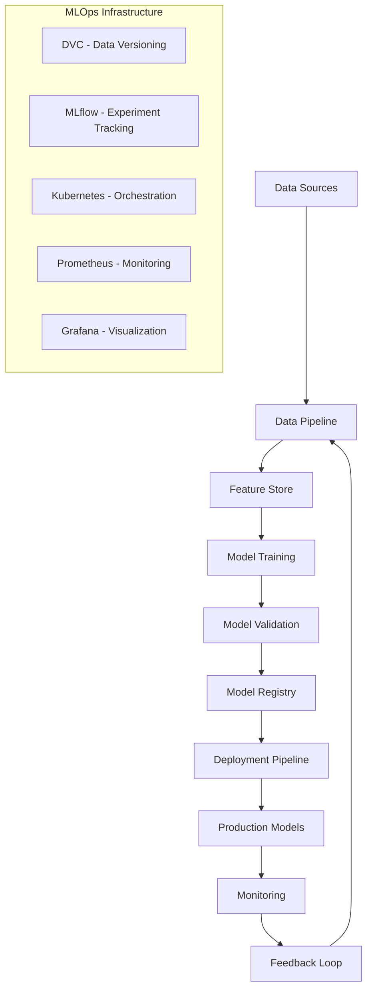

# 🚀 AI Studio MLOps - Complete Machine Learning Operations

This directory contains the complete MLOps infrastructure for the AI Studio platform, providing automated machine learning pipelines, model versioning, deployment automation, and comprehensive monitoring.

## 📋 Table of Contents

- [Overview](#overview)
- [Architecture](#architecture)
- [Pipeline Components](#pipeline-components)
- [Setup & Configuration](#setup--configuration)
- [Usage Guide](#usage-guide)
- [Monitoring & Observability](#monitoring--observability)
- [Deployment Strategies](#deployment-strategies)
- [Best Practices](#best-practices)
- [Troubleshooting](#troubleshooting)

## 🎯 Overview

The AI Studio MLOps pipeline provides:

- **Automated ML Pipelines**: End-to-end training, validation, and deployment
- **Model Versioning**: Track model iterations and experiments
- **Quality Assurance**: Automated testing and validation
- **Deployment Automation**: Blue-green and canary deployments
- **Performance Monitoring**: Real-time model and system monitoring
- **Data Management**: Version-controlled datasets and features
- **Compliance & Security**: Built-in governance and security measures

## 🏗️ Architecture



### Key Components

1. **Data Pipeline**: Automated data ingestion, cleaning, and feature extraction
2. **Training Pipeline**: Multi-stage model training with hyperparameter optimization
3. **Validation Pipeline**: Comprehensive model testing and quality assurance
4. **Deployment Pipeline**: Automated deployment with rollback capabilities
5. **Monitoring System**: Real-time performance and drift detection

## 🔧 Pipeline Components

### 1. Data Preparation Pipeline

```yaml
# dvc.yaml - data_preparation stage
data_preparation:
  cmd: python scripts/prepare_data.py
  deps:
    - data/raw/
    - params.yaml
  outs:
    - data/processed/train_data.jsonl
    - data/processed/validation_data.jsonl
    - data/processed/test_data.jsonl
```

**Features:**
- Multi-source data ingestion (JSON, CSV, text files)
- Automated data quality checks and filtering
- PII removal and content safety screening
- Domain-balanced dataset creation
- Train/validation/test splits with stratification

### 2. Model Training Pipeline

```yaml
# Base model training
train_base_models:
  cmd: python scripts/train_base_models.py
  params:
    - base_model_training
  metrics:
    - metrics/base_training_metrics.json
```

**Supported Models:**
- **Phi-2**: 2.7B parameter language model
- **CodeT5+**: Code-specialized encoder-decoder
- **T5-Small**: General-purpose text-to-text transformer

**Training Features:**
- Mixed precision training
- Gradient accumulation for large batch sizes
- Learning rate scheduling
- Early stopping with patience
- Automatic checkpointing

### 3. Domain Specialization

```yaml
# Domain-specific fine-tuning
finetune_domain_models:
  cmd: python scripts/finetune_domain_models.py
  params:
    - domain_finetuning
```

**Specialization Domains:**
- **Code**: Programming, debugging, code review
- **Creative**: Writing, storytelling, content creation
- **Analysis**: Data analysis, insights, reporting
- **Summarization**: Text summarization, key points extraction

### 4. LoRA Adapter Training

```yaml
# LoRA adapter training for parameter-efficient fine-tuning
train_lora_adapters:
  cmd: python scripts/train_lora_adapters.py
  params:
    - lora_training
```

**LoRA Benefits:**
- 99% reduction in trainable parameters
- Fast adaptation to new domains
- Multiple adapters per base model
- Easy switching between specializations

### 5. Model Quantization

```yaml
# Model optimization through quantization
quantize_models:
  cmd: python scripts/quantize_models.py
  params:
    - quantization
```

**Quantization Options:**
- **4-bit**: Maximum memory efficiency with BitsAndBytes
- **8-bit**: Balanced performance and memory usage
- **Dynamic**: Runtime quantization for inference

## ⚙️ Setup & Configuration

### Prerequisites

```bash
# Install required packages
pip install -r requirements-mlops.txt

# Additional dependencies
pip install dvc[s3] mlflow wandb
```

### Environment Setup

1. **Initialize DVC Repository**
```bash
# Initialize DVC
dvc init

# Add remote storage (S3 example)
dvc remote add -d s3_storage s3://your-bucket/ai-studio/
dvc remote modify s3_storage region us-west-2
```

2. **Configure MLflow Tracking**
```bash
# Set MLflow tracking URI
export MLFLOW_TRACKING_URI=http://localhost:5000

# Or use remote tracking server
export MLFLOW_TRACKING_URI=https://your-mlflow-server.com
```

3. **Setup Kubernetes (Production)**
```bash
# Install required tools
kubectl apply -f k8s/namespace.yaml
kubectl apply -f k8s/mlflow-deployment.yaml
kubectl apply -f k8s/monitoring-stack.yaml
```

### Configuration Files

1. **params.yaml**: Central parameter configuration
2. **dvc.yaml**: Pipeline stage definitions
3. **mlflow.yaml**: Experiment tracking configuration
4. **.dvcignore**: Files to ignore in DVC tracking

## 🚀 Usage Guide

### Running the Complete Pipeline

```bash
# Run entire MLOps pipeline
dvc repro

# Run specific stage
dvc repro train_base_models

# Run with specific parameters
dvc repro -f train_base_models
```

### Experiment Tracking

```python
# Track experiments with MLflow
import mlflow

with mlflow.start_run():
    # Log parameters
    mlflow.log_params(params)
    
    # Train model
    model = train_model()
    
    # Log metrics
    mlflow.log_metrics(metrics)
    
    # Log model
    mlflow.pytorch.log_model(model, "model")
```

### Model Registry Operations

```bash
# Register model version
mlflow models register-model \
  --model-uri runs:/RUN_ID/model \
  --name "phi2_code_specialist"

# Promote to production
mlflow models update-model-version \
  --name "phi2_code_specialist" \
  --version 1 \
  --stage "Production"
```

### Data Version Control

```bash
# Track new dataset
dvc add data/new_training_data.jsonl
git add data/new_training_data.jsonl.dvc
git commit -m "Add new training dataset"

# Push data to remote storage
dvc push

# Pull specific data version
dvc pull data/training_data.jsonl.dvc
```

## 📊 Monitoring & Observability

### Performance Monitoring

The MLOps pipeline includes comprehensive monitoring:

```python
# Model performance monitoring
class ModelMonitor:
    def __init__(self):
        self.metrics_collector = PrometheusMetrics()
    
    def log_prediction(self, input_data, prediction, latency):
        self.metrics_collector.observe_latency(latency)
        self.metrics_collector.increment_predictions()
        
        # Detect data drift
        if self.detect_drift(input_data):
            self.alert_manager.send_alert("Data drift detected")
```

### Key Metrics Tracked

1. **Model Performance**
   - Accuracy, precision, recall
   - Latency percentiles (p50, p95, p99)
   - Throughput (requests/second)
   - Error rates

2. **Data Quality**
   - Input distribution drift
   - Feature importance changes
   - Missing value rates
   - Outlier detection

3. **System Health**
   - Resource utilization (CPU, memory, GPU)
   - Container health and restarts
   - API response times
   - Queue lengths

### Alerting Rules

```yaml
# Prometheus alerting rules
groups:
  - name: model_performance
    rules:
      - alert: ModelAccuracyDrop
        expr: model_accuracy < 0.85
        for: 5m
        labels:
          severity: critical
        annotations:
          summary: "Model accuracy below threshold"
          
      - alert: HighLatency
        expr: prediction_latency_p95 > 2000
        for: 2m
        labels:
          severity: warning
        annotations:
          summary: "High prediction latency detected"
```

## 🚢 Deployment Strategies

### Blue-Green Deployment

```yaml
# Blue-Green deployment configuration
apiVersion: argoproj.io/v1alpha1
kind: Rollout
metadata:
  name: ai-studio-model
spec:
  replicas: 5
  strategy:
    blueGreen:
      activeService: ai-studio-active
      previewService: ai-studio-preview
      scaleDownDelaySeconds: 30
      prePromotionAnalysis:
        templates:
        - templateName: success-rate
        args:
        - name: service-name
          value: ai-studio-preview
```

### Canary Deployment

```yaml
# Canary deployment with traffic splitting
spec:
  strategy:
    canary:
      steps:
      - setWeight: 10    # 10% traffic to new version
      - pause: {duration: 10m}
      - setWeight: 50    # 50% traffic
      - pause: {duration: 10m}
      - setWeight: 100   # Full rollout
```

### A/B Testing

```python
# A/B testing framework
class ABTestManager:
    def __init__(self):
        self.experiments = {}
    
    def get_model_variant(self, user_id):
        # Determine which model variant to use
        if hash(user_id) % 100 < self.config.treatment_percentage:
            return "model_v2"
        return "model_v1"
    
    def log_outcome(self, user_id, variant, outcome):
        # Log A/B test results
        self.metrics_collector.log_ab_result(
            user_id=user_id,
            variant=variant,
            outcome=outcome
        )
```

## 🎯 Best Practices

### 1. Data Management
- **Version everything**: Code, data, models, and configurations
- **Validate data quality**: Implement automated data quality checks
- **Handle data drift**: Monitor and retrain when drift is detected
- **Secure sensitive data**: Implement proper data governance

### 2. Model Development
- **Use feature stores**: Centralize feature engineering and serving
- **Implement model validation**: Comprehensive testing before deployment
- **Track experiments**: Log all experiments and model iterations
- **Automate hyperparameter tuning**: Use tools like Optuna or Ray Tune

### 3. Deployment
- **Gradual rollouts**: Use canary or blue-green deployments
- **Health checks**: Implement comprehensive health monitoring
- **Rollback capabilities**: Ensure quick rollback mechanisms
- **Resource management**: Set appropriate resource limits and requests

### 4. Monitoring
- **Monitor everything**: Models, data, infrastructure, and business metrics
- **Set up alerting**: Proactive alerting for issues
- **Dashboard creation**: Create operational dashboards for different stakeholders
- **Performance baselines**: Establish and maintain performance baselines

### 5. Security & Compliance
- **Model security**: Protect model weights and inference endpoints
- **Data privacy**: Implement proper data handling procedures
- **Access control**: Role-based access to MLOps resources
- **Audit trails**: Maintain comprehensive audit logs

## 🔧 Troubleshooting

### Common Issues

#### Pipeline Failures

```bash
# Check DVC pipeline status
dvc status

# Debug specific stage
dvc repro --dry train_base_models

# Check logs
tail -f logs/training.log
```

#### Memory Issues

```bash
# Monitor memory usage
kubectl top nodes
kubectl top pods

# Scale resources
kubectl patch deployment ai-studio-api -p '{"spec":{"template":{"spec":{"containers":[{"name":"api","resources":{"limits":{"memory":"8Gi"}}}]}}}}'
```

#### Model Loading Errors

```python
# Debug model loading
try:
    model = load_model("model_path")
except Exception as e:
    logger.error(f"Model loading failed: {e}")
    # Check model format and compatibility
    check_model_compatibility("model_path")
```

#### Data Pipeline Issues

```bash
# Validate data pipeline
python scripts/validate_pipeline.py

# Check data quality
python scripts/check_data_quality.py --input data/processed/

# Repair corrupted data
dvc doctor
dvc fetch --remote s3_storage
```

### Performance Optimization

#### Model Optimization
- Use quantization for memory efficiency
- Implement model pruning for speed
- Optimize batch sizes for throughput
- Use ONNX runtime for inference

#### Infrastructure Optimization
- Use GPU acceleration where beneficial
- Implement proper caching strategies
- Optimize container images
- Use horizontal pod autoscaling

### Debugging Commands

```bash
# DVC debugging
dvc doctor                    # Check DVC setup
dvc dag                      # Visualize pipeline
dvc metrics show             # Show all metrics
dvc plots show               # Show all plots

# Kubernetes debugging
kubectl describe pod POD_NAME
kubectl logs POD_NAME -f
kubectl exec -it POD_NAME -- bash

# MLflow debugging
mlflow doctor                # Check MLflow setup
mlflow runs list            # List all runs
mlflow models list          # List registered models
```

## 📚 Additional Resources

### Documentation
- [DVC Documentation](https://dvc.org/doc)
- [MLflow Documentation](https://mlflow.org/docs/latest/index.html)
- [Kubernetes Documentation](https://kubernetes.io/docs/)
- [Prometheus Documentation](https://prometheus.io/docs/)

### Example Scripts
- `scripts/train_models.py`: Complete training pipeline
- `scripts/evaluate_models.py`: Model evaluation and benchmarking
- `scripts/deploy_models.py`: Deployment automation
- `scripts/monitor_models.py`: Monitoring and alerting

### Configuration Templates
- `configs/training_config.yaml`: Training configuration template
- `configs/deployment_config.yaml`: Deployment configuration template
- `configs/monitoring_config.yaml`: Monitoring configuration template

---

**Need Help?** 
- Check the [troubleshooting guide](#troubleshooting)
- Review pipeline logs in `logs/`
- Contact the MLOps team for support

**Contributing:**
- Follow the MLOps best practices guide
- Test all pipeline changes in staging
- Update documentation for any new features
- Ensure all tests pass before deployment

Built with ❤️ for reliable and scalable ML operations.